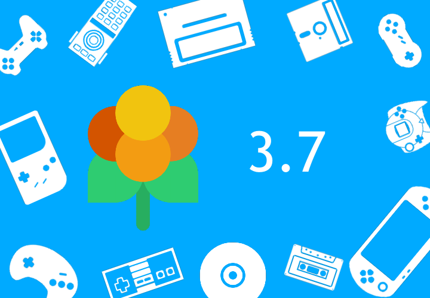

New version of Lakka has been released!

We are happy to announce the new and updated version of Lakka.

# Release summary

Changes since version 3.6:

- RetroArch updated to [1.10.0](https://www.libretro.com/index.php/retroarch-1-10-0-release/)
  - Fixed crashing when recording/streaming
- Cores updated to their most recent versions
  - `wasm4`: added new libretro core
  - `jumpnbump`: added new libretro core
  - `blastem`: added new libretro core
  - `freechaf`: added new libretro core
  - `potator`: added new libretro core
  - `quasi88`: added new libretro core
  - `retro8`: added new libretro core
  - `xmil`: added new libretro core
  - `fmsx`: added new libretro core
- Mesa updated to [21.3.6](https://docs.mesa3d.org/relnotes/21.3.6.html)
- Mainline kernel updated to 5.10.101
- Raspberry kernel/firmware reverted to 1.20210831 (to work around issue with 4K displays not initializing)
- Disabled wifi powersaving on Raspberry devices to improve wifi stability
- Added support for Raspberry Pi Zero 2 W with GPICase
- Added [utility](https://github.com/spleen1981/xbox360-controllers-shutdown) to turn of Xbox360 gamepads

## Recording

For new installs, recorded videos will be saved in `/storage/recordings` accessible via SAMBA share `Recordings`. If you update from earlier version, RetroArch will by default save videos to `/storage/.config/retroarch/records`, which is also accessible via SAMBA share `Configfiless` &rarr; `retroarch` &rarr; `records`. You can change the default path for saving videos via `Settings` &rarr; `Directory` &rarr; `Recordings`.

# Known issues

See [GitHub](<%= config[:links][:github] %>/issues) for information about currently open bugs and issues and also for possible workarounds for these bugs/issues.

# Final notes

You can download the latest release from [Lakka download page](/get/). If you want to follow the development of Lakka more closely, you can download [latest Lakka nightly builds](<%= @config[:devel][:'all-latest'] %>).

If you want to show your support for further development of the Libretro projects and ecosystem, you can learn more [here](https://retroarch.com/index.php?page=donate).

Happy retro-gaming!
